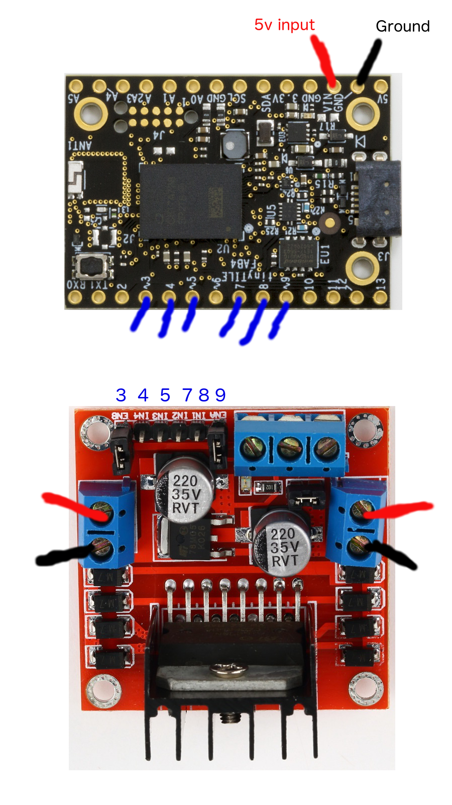

# Citrix Synergy  - Simply Serve

## Hello World

[https://pagenodes.com](https://pagenodes.com)

* send message to uuid:
`d678af0a-aa81-4c17-9ed4-aeb5f1dc2ffc`

## Web Bluetooth

## Bot Assembly
* connect motors
* connect pins
* connect battery pack
* secure the pieces
* customize

## Bot connecting.

* service Id: `bada5555-e91f-1337-a49b-8675309fb099`

* digital Characteristic `2a56`

* analog Characteristic `2a58`

## directional movement

* Right wheel forward:
digital: `[8,1]` and `[7,0]`

* Left wheel forward:
digital: `[5,1]` and `[4,0]`

* Right wheel reverse:
digital: `[8,0]` and `[7,1]`

* Left wheel reverse:
digital: `[5,0]` and `[4,1]`

## speed

* Right wheel full speed:
analog: `[9,255]`

* Left wheel full speed:
analog: `[3,255]`

* Right wheel STOP:
analog: `[9,0]`

* Left wheel STOP:
analog: `[3,0]`
